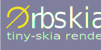

# Workspace orbtk_tinyskia

Rendering is a key component of the toolkit. Everybody is expecting state
of the art presentation of implemented widgets. User interaction that will
result in layout and entity changes inside the GUI should be updated as
soon as possible. A comfortable user experience is mainly influenced by
fast rendering tasks. New rendering of layouts should only take place, if
constraint changes will need to do so. Entities and their attributes will
only require new rendering if a user interaction changes their state
to be dirty.

Lets summarize the main goals of `OrbTK` rendering infrastructure:

* API encapsulated access to all renderer functions

  This design decision is taken to keep freedom for further development of
  OrbTK when it comes to support different renderers. We are able to support

	* different versions of a given renderer
	* support different renderer for different target platforms

* 2D rendering fast and complete implementation of all rendering functions
  used in the OrbTK toolkit.provided functions

  * Pixmaps
  * Canvas
  * Path
  * geometry primitives
  * Blending modes
  * Path filling
  * Anti-aliased Path filling
  * Path stroking
  * Path hairline stroking
  * Anti-aliased Path hairline stroking
  * Stroke dashing
  * Gradients (linear and radial)
  * Pixmaps blending (image on image rendering)
  * Patterns
  * Fill rect
  * Stroke rect
  * Rectangular clipping
  * Clipping
  * Anti-aliased clipping
  * Analytical anti-aliased Path filling
  * Dithering
  * Blending modes
