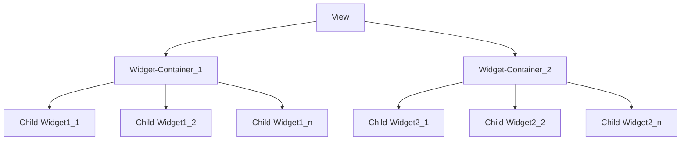
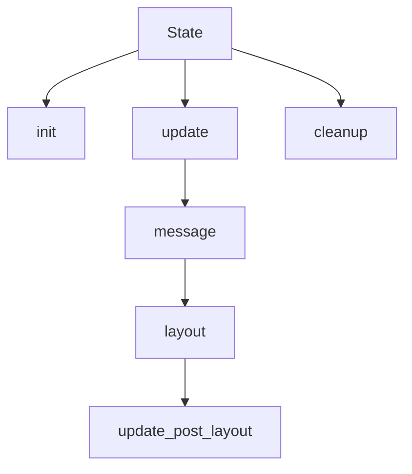

# Die Bestandteile

`OrbTk` stellt eine [interactive functional reactive][functional_reative]
API bereit. Es hängt dabei elementar vom Rust crate [`DCES`][dces] ab, welches
ein Entity Component System bereitstellt. Die Interaction mit `DCES` wird vom
`Entity Component Manager`(ECM) übernommen. Einem Wrapper API, das
`OrbTk` widgets transparent in `ECM` Enititäten und  `OrbTk` Attribute (properties) in
`ECM` Komponenten (components) übersetzt und verwaltet.
`DCES` ist wie `OrbTk` selbst nativ in Rust geschrieben.

[dces]: https://docs.rs/dces
[functional_reative]: https://en.wikipedia.org/wiki/Functional_reactive_programming

## The widget view

Workflow 1-1: Verarbeitung-Methoden `Ansicht`

Wenn Du eine OrbTK Anwendung erstellst kombinierst Du letztlich
`widgets`.  Widgets sind die Kern-Bausteine von Benutzer
Schnittstellen in OrbTK in denen eine bestimmte Aufgabe verarbeitet
wird. Das vorhandene Modell ist dynamisch strukturiert. Es ist legitim
und ohne weiteres möglich Deine eigenen Widget-Typen zu
erstellen, oder aber auf die vordefinierten Implementierungen
zurückzugreifen.

Um einen `widget-tree` zu erzeugen könntest Du beispielsweise einen
`ListView` erstellen. Der `Listview` seinerseits verwendet als
Kind-Widget eine `TextBox` die wiederum als Kind-Widget einen `Button`
nutzt. Letztlich hast Du so ein ein hierarchisch geordnete
Benutzer-Schnittstelle geschaffen (einen `view`), der den für den
Anwender einen sichtbaren Teil Deiner Anwendung repräsentiert. Ein
widget-tree wird in eine eindeutig adressierbaren `widget-container`
eingebunden.

### Widget trait

Ein widget muss zwingend ein Widget trait erzeugen. Hierzu hilft das Makro
`widget!()`.

Ein widget besteht zunächst aus einem Namen (z.B. `Button`) und
einer Liste von Eigenschaften die angebunden sind (z.B `text: String`,
`background: Brush` oder `count: u32`). Wird die `build()` Methode in
einem widget aufgerufen, wird dieses widget zusammen mit seinen
Komponenten im Entity Component System registriert. Diese
Registrierung weist ihm als `Entity` einen eindeutigen Index-Wert zu.
Dieser `Entity` werden nun die zugewiesenen `Components`, als
Komponenten-Namen zugeordnet und ebenfalls im ECS gespeichert.
Der widget-container stellt hierbei die erforderliche builder Struktur.

### Widget Template

Jedes widget muss zwingend das `Template` trait implementieren. Das
*template* definiert neben dem Strukturaufbau auch die Standardwerte
der zugewiesenen *widget* Eigenschaften (seine **properties**).
Nehmen wir zum Beispiel einen Button, der sich aus einem Container
Widget, einem StackPanel Widget und einem TextBox Widget
zusammensetzt.

Ein ganz wesentlicher Konzeptbaustein von OrbTK ist dabei die
Trenneung eines `views`, also der beschreibenden Natur eines
Widget-Baums, von den Methoden die auf Benutzereingaben in der GUI
reagieren und sie verarbeiten (der Widget `state`). Diese Trennung ist
der Schlüssel für eine schnelle, flexible und erweiterbare Struktur
innerhalb von OrbTk.

## Der widget state

Workflow 1-2: Verarbeitungs-Methoden `State`

Widgets verwenden traits, die erst eine interaktive Verarbeitung
ermöglichen.  Wie bezeichnen sie den Widget `state`. Innerhalb der
`state` Methoden definieren wir den Verarbeitungs- und
Kontroll-Quellcode, der an eine eindeutige Aufgabe geknüpft ist.

Es ist **nicht** erforderlich, einen `state` für ein Widget zu
definieren. Existiert kein `state` zu einem Widget beschneidest Du
damit aber die Möglichkeit eigenschaften während der Laufzeit
programmatisch zu verändern. Der `view` diese Widgets bleibt damit
statisch.

Definierst du einen Widget `state`, ererbt dieser neben den
implementierten Systemen auch die Werte der zugewiesenen Eigenschaften
(`current values` of properties). Um den programmatischen Zugriff auf
die Werte zu erhalten, muss jeder state die `Default` oder `AsAny`
traits erzeugen, bzw. ableiten (via `derive` macro). Du kannst für
einen `state` beliebige assoziierte Funktionen (`methods`) erzeugen,
die sowohl auf Ereignisse der zugeordneten Systeme reagieren
(z.B. `messages`, `events`) oder auch die aktuellen Werte der
Eigenschaften verändern können. Die Eigenschaften (`properties`) sind
im ECM gespeichert, deren Aufbau sich an der Baum Struktur orientiert
(parent, children or level entities).

## GUI Elements

* Layouts
* Events
* Behaviors
* Messages

### Layouts

#### Warum brauchen wir Layouts?

Nun, betrachten wir ein eingängiges Beispiel, das in jeder modernen
Applikation umgesetzt werden muss: Mehrere Sprachvarianten sind
erforderlich! Und der Wechsel der gewählten Sprachvariante soll zur
Laufzeit erfolgen. Wir können sicher davon ausgehen, das sich jeder
verwendete Bezeichner für Felder und Beschreibungen in den jeweiligen
Sprachen unterscheidet. Wortlängen und Glyphenbreiten in den Schriften
sind anders. Natürlich ist ebenso die gewählte Schriftart bei der
Berechnung der Größe zu berücksichtigen. Was würde passieren, wenn Du
beispielsweise die Größe einer Entität statisch festlegst? Wir würden
z.B. einen Button mit einer festen Größe kodieren. Wie reagierst Du
nun auf Kontext-Veränderungen von untergeordneten Entitäten (childs)?
Wie gehst Du damit um, dass sich z.B ein Button-Bezeichner, den der Anwender
wahrscheinlich zentriert im Button Rahmen erwartet verändert?

Puh, Du als der Programmierer müsstest an alle möglichen GUI
Darstellungen denken, programmatisch auf jede denkbare
Spracheveränderung reagieren. Ein Alptraum! Nein, wir brauchen einen
tragfähigeren Ansatz.

#### Unsere Lösung

`OrbTk` verwendet ein `layout` System. Dieses System unterstützen die
Möglichkeit, die Größe einer Entität anhand der natürlichen
Dimensionen des Inhalts aufzubereiten. Damit ist es im Toolkit möglich
den gesammten Entitätenbaum im Layout dynamisch anzupassen. Ändert
sich die Applikationslogik und damit die Notwendigkeit einzelne
Entitäten hinzuzufügen, zu verändern oder auszublenden wird dies für
den gesamten Baum in einem dynamischen Layout Prozess umgesetzt. Dabei
werden die individuellen Vorgaben der einzelnen Entitäten
berücksichtigt (`constaints`).

Die individuellen Vorgaben der Entitäten werden über Eigenschaften
(`properties`) als Komponenten im `DCES` gespeichert (`components`).
Das Konzept folgt einem zwei Phasen Modell. Ein Layout wird daher auch in
zwei Arbeitsschritten verarbeitet:

  * `Measuring` Phase
  * `Arrangement` Phase

#### Measuring

Die `Measuring` Phase erlaubt uns, die **gewünschte Größe** einer
`boxed` Entität zu berechnet (**desired size**). Die gewünschte Größe
ist eine Struktur, die die maximalen Werte für Breite und Höhe einer
Entität angibt. Diese Werte werden innerhalb des `DCES` persistent
gespeichert. Wenn die Verarbeitung eine Wertänderung der gewünschten
Größe feststellt (die gespeicherte und die aktuelle Größe
unterscheiden sich), wird die Kennzeichnung `dirty` in der Struktur aktualisiert.

#### Arrangement

Die Plazierung (`Arranging`) erfolgt in einem weiteren separaten
Schritt.  Der Vorgang arbeitet den Baum der angesprochenen Elemente in
einer Schleife ab. Dabei verwendet er die **bounds** es jeweiligen
Elements. Ein **bound** beschreibt die finalisierte Position der
Ausrichtung des Elements (Höhe, Breite) und speichert diese im `DECS`.
Ein Verarbeitungs-Prozess wird nur dann initiiert, wenn ein Element
innerhalb des Baums eine neue Anordnung erzwingt. Alle Elemente werden
nur dann mit den neuen Positionen im Ausgabe-Puffer (`render buffer`) neu
angeordnet, wenn ihr aktiver Status die als `dirty` gekennzeichnet ist.

#### Layout Methods

`OrbTk` unterstützt unterschiedliche Layout Methoden. Dies sind darauf
optimiert, spezifische Anforderungen der unterschiedlichen
Widget-Typen zu berücksichtigen:

* Absolute
* Fixed size
* Grid
* Padding
* Popup
* Stack

Du findest deren Quellcode im Workspace `orbtk_core` im Unterverzeichnis `layout`.
Weitere Informationen zu diesen Methoden werden im
[Kapitel: Orbtk Core][layout] besprochen.

[layout]: https://doc.redox-os.org/orbtk-book/ch02-02-workspace-orbtk-core.html#layout

### Events

* bottom-up

Ein Ereignis wandert bei der Verarbeitung vom Auftreten am Blatt des
Enitätenbaums (`leaf entity`) zum Stamm (`root entity`). Also von
Unten nach Oben - oder von Aussen nach Innen.

* top-down

Ein Ereignis wandert bei der Verarbeitung vom Auftreten am Stamm
(`root entity`) zu den Blätter des Enitätenbaums (`leaf entity`). Also
von Oben nach Unten - oder von Innen nach Außen.

### Behaviours

Es existieren diffenzierte Methoden für die Bearbeitung logisch gruppierter Ereignisse.
Hierzu zählen derzeit die Ereignis-Klassen

* Mouse Behaviors
* Selection Behaviors
* Text Behaviors

Die Ereignisse können sowohl von Eingabe-Geräten (z.B. Tastatur, Maus)
aber auch aus der funktionalen Logik heraus erzeugt werden (z.B. durch Fokus
Änderung, Textanpassungen, etc.)

### Messages

Über das Konzept von MessageAdaptern können Nachrichten zwischen beliebigen
Sender- und Empfänger-Widget gesendet und ausgelesen werden. Die
verwendeten Methoden sind `thread save`.

Jedes Widget kann im State code eine `message` Methode
definieren. Hier ist der Entwickler frei, welche MessageAdapter
berücksichtigt werden sollen. Die Verarbeitungslogik für ausgelesende
Nachrichten ist somit wahlfrei.

## Framework Elements

Alle Elemente des `ObtTk` Frameworks sind als Sub-Module innerhalb des API organisiert.
