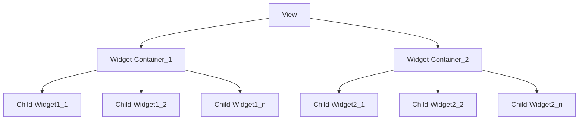
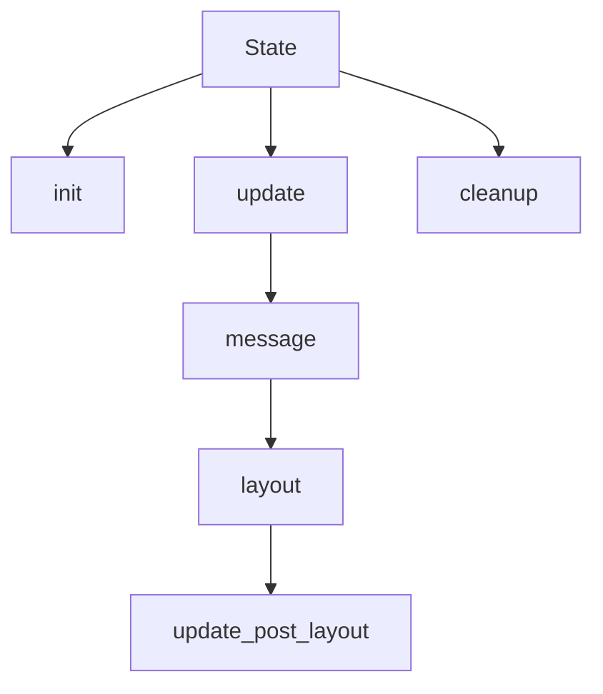

# The Ingredients

`OrbTk` provides an [interactive functional
reactive][functional_reactive] API. It depends on the rust
[`DCES`][dces] crate, that provides an Entity Component
System. Interaction with `DCES` is managed via the `Entity Component
Manager`(ECM), a wrapper API, that transparently maps `OrbTk` widgets
to `ECM` entities and `OrbTk` properties to `ECM` components.

[dces]: https://docs.rs/dces
[functional_reactive]: https://en.wikipedia.org/wiki/Functional_reactive_programming

## The widget view

Workflow 1-1: View handling methods

When you construct an OrbTk application, you are essentially combining
`widgets`. Widgets are the building blocks of user interfaces in
OrbTk, dedicated to a given task. The given model is dynamically
structured. You are free to implement your own widget type or consume
the predefined implementations.

To make up a `widget-tree`, you may construct a `ListView`, that
instantiates a child `TextBox` that itself instantiates a child
`Button`. You end up with an ordered user interface (the `view`), the
visible part of your app. Each widget-tree is stacked into a uniquely
addressable `widget-container`.

### Widget trait
Each widget need to implement the Widget trait. It is generated by the
`widget!();` macro.

A widget consists of a name (eg. `Button`) that is bound to a list of
properties (eg. `text: String`, `background: Brush` or `count:
u32`). When the `build method` of a widget is called inside the
widget-tree, that widget is added to the Entity Component System with
a unique `Entity` (index) that holds corresponding `Components` (property
names). The struct of the widget-container serves as its builder pattern.

### Widget Template
Each widget has to implement the `Template` trait. The template defines
the default values of a widget's properties as well as its
structure. E.g. a Button consists of a Container widget, a StackPanel
widget and a TextBox widget.

Separating the `view` as the descriptive nature of a widget tree from
the code that reacts and handles user input (it's `state`), is an
essential conceptual decision. It is key to enable the fast, flexible
and extendable structure of OrbTk.

## The widget state

Workflow 1-2: State handling methods

Widgets make use of traits, that come in handy to provide
interactivity. We call them the widget `state`. Inside the `state`
routines, we declare the processing and controlling code dedicated to
a given task. The given model is dynamically structured. You are free
to implement your own widget type or consume the predefined
implementations.

It is **not** required to define a `state` for a widget. But if you
don't, you cut of the possibility to adapt properties during
runtime. The `view` of the widget will stay static.

When defining a `state` of a widget, it inherits the values of its
associated properties (`current values`), as well as the implemented
system. To gain access, each state has to derive or implement the
`Default` and the `AsAny` traits. You are free to implement
associated functions to the `state`, that react on triggered events or
adapt current values. The `properties` are stored via ECM. They are
organized in a tree (parent, children or level entities).

## GUI Elements

* Layouts
* Events
* Behaviors
* Messages

### Layouts

Layouts are addressing the problem, that each widget inside the UI
needs individual placement. This requires a dynamic calculation of its
space requirements coupled with is target specific positioning when
interacting with the display device.

#### Why do we need layouts?

Well, lets take an obvious example that meets every modern
application: You have to support multiple language variants! Changing
the selected localization should be possible at runtime. We do expect,
that each needed idiom inside our application will for sure differ in
their label length, as well as the sizes of used glyphs in the
selected fonts. What would happen, if we would size the entities
statically? We would code e.g a button with a given size. How to react
on content changes of its child entity (e.g. a label that is expected
to be centered inside the button frame)?

Pugh, you as the programmer would need to adapt the GUI views for every
supported language and react on pragmatically on any of this size
changes. A nightmare! This is nonsense. We have to define and render
the stuff the other way around!

#### Our solution

`OrbTk` uses a `layout` system. This system support the ability to
determine the natural size of the content elements. It allows a dynamic
approach to layout all entities inside the toolkit. No matter if the
application logic requires to add or subdivide other entities inside
the widget tree. Or if contents is changed through theme adaption or
user interaction: all involved entities are processed and resized as
needed, respecting their individual constraints.

Constraints are defined via entity properties that are
stored as components inside the `DCES`. The concept follows a two
phase model. It will process the entity tree in two passes:

  * `Measuring` pass
  * `Arrangement` pass

This is the reason, we call it a `functional_reactive` Toolkit.

#### Measuring

The `Measuring` pass allows us to determine the **desired size** of a
`boxed` entity. A desired size is a structure, that holds the maximum
values for the width and height of the entity in question. This values
are stored inside `DCES`. If computation recognizes a size change of
the `desired size`, which means the stored and the current value of
its property differs, the `dirty flag` is set. The measuring will
result in an update of the associated bound values inside the `DECS`
entity (structure **desired size**).

#### Arrangement

The `Arrangement` is following in a separate run. It will trigger the
2D rendering task. This task walks down the element tree and consume
the **bounds** of each entry. A `bound` describes the finalized
alignment position of an entity (height, width) and is stored inside
the `DCES`. Computation tasks are only triggered, if the values of
a tree element have changed, which will be indicated via the `dirty`
flag. All referenced elements that are affected by this changed values
need to be rearranged. Their positions are recomputed with the
appropriate values inside the render buffer, since the active state
was marked dirty.

After the arrangement pass, the dirty flag is cleaned, which will omit
any further computational needs. Once the state of an entity is marked
as dirty again, the pass runs are triggered as desired.

#### Layout Methods

`OrbTk` supports a number of dedicated layout methods, that are
designed to handle the specific demands of a given widget type:

* Absolute
* Fixed size
* Grid
* Padding
* Popup
* Stack

You can find the relevant code inside the `orbtk_core` workspace. The methods are inside the sub-directory `layout`.
Further information towards this methods are discussed in [Chapter: Orbtk_core][layout].

[layout]: https://doc.redox-os.org/orbtk-book/ch02-02-workspace-orbtk-core.html#layout

### Events

* bottom-up

If the events traverse from a leaf entity up to the root entity.

* top-down

If the events traverse from the root entity down to the leaf entities.

### Behaviours

Specialized event handling that reacts on signals. Signals may be fired from ether input devices
(e.g. mouse, keyboard) or inside the functional logic (e.g. changing  focus, text, etc).

### Messages

An intelligent messaging infrastructure that instantiates subs. The
concept enables the toolkit to send and receive messages between the
linked entities (m senders -> n receivers).

## Framework Elements

The elements are organised as sub-modules inside the API sub-tree.
