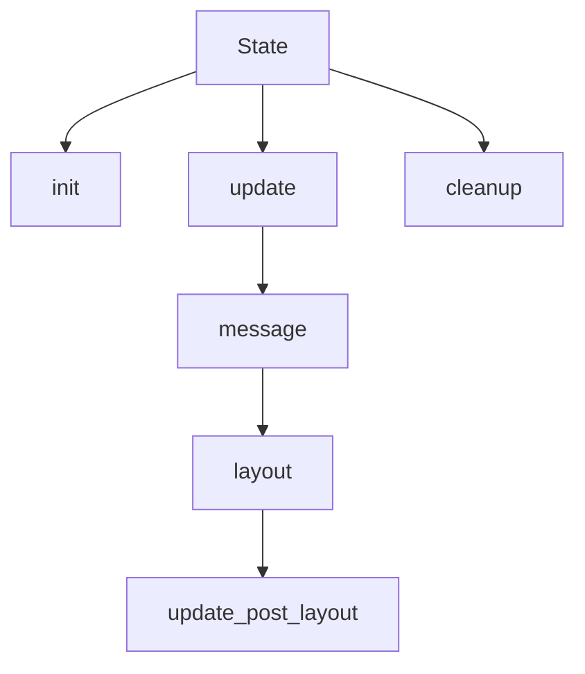

# The Ingredients

> WIP: introduce a graphical representation of the structure

`OrbTk` provides an [interactive functional
reactive][functional_reactive] API. It depends on the rust
[`DCES`][dces] crate, that provides an Entity Component
System. Interaction with `DCES` is managed via the `Entity Component
Manager`(ECM), a wrapper API, that transparently maps `OrbTk` widgets
to `ECM` entities and `OrbTk` properties to `ECM` components.

[dces]: https://docs.rs/dces
[functional_reactive]: https://en.wikipedia.org/wiki/Functional_reactive_programming

## GUI Elements

* Layouts
* Events
* Behaviors
* Messages

### Layouts

Workflow 1-1: State handling methods

#### Why do we need layouts?

Well, lets take an obvious example that meets every modern
application: You have to support multiple language variants! Changing
the selected localization should be possible at runtime. We do expect,
that each needed idiom inside our application will for sure differ in
their label length, as well as the sizes of used glyphs in the
selected fonts. What would happen, if we would size the entities
statically? We would code e.g a button with a given size. How to react
on content changes of its child entity (e.g. a label that is expected
to be centered inside the button frame)?

Pugh, you as the programmer would need to adapt the GUI views for every
supported language and react on pragmatically on any of this size
changes. A nightmare! This is nonsense. We have to define and render
the stuff the other way around!

#### Our solution

`OrbTk` uses a `layout` system. This system support the ability to
determine the natural size the content elements. It allows a dynamic
approach to layout all entities inside the toolkit. No matter if the
application logic requires to add or subdivide other entities inside
the widget tree. Or if contents is changed though theme adaption or
user interaction: all involved entities are processed and resized as
needed, respecting their individual constraints.

Constraints are defined via entity properties that are
stored as components inside the `DCES`. The concept follows a two
phase model. It will process the entity tree in two passes:

  * `Measuring` pass
  * `Arrangement` pass

This is the reason, we call it a `functional_reactive` Toolkit.

#### Measuring

The `Measuring` pass allows us to determine the **desired size** of a
`boxed` entity. A desired size is a structure, that holds the max values for
the width and height of the entity in question. This value is stored
inside `DCES`. If computation recognizes a size change of the desired
size (the stored and the current value differs), the dirty flag will
be updated in the structure.

#### Arrangement

The `Arrangement` is following in a separate run. It will trigger the
2D rendering task. This task walks down the element tree and consume
the **bounds** of each entry. A bound describes the finalized
alignment position of an entity (height, width) and is stored inside
the `DCES`. Computation tasks are only triggered, if the tree element
will require an update arrangement. All elements will be rearranged
and positioned as appropriate inside the render buffer, it their
active state is marked dirty.

#### Layout Methods

`OrbTk` supports a number of dedicated layout methods, that are designed
to handle the specific demands of a given widget type:

* Absolute
* Fixed size
* Grid
* Padding
* Popup
* Stack

You can find the relevant code inside the `orbtk_core` workspace. The methods are inside the sub-directory `layout`.
Further information towards this methods are discussed in [Chapter: Ortk_core](ch02-02-workspace-orbtk-core.md#layout).

### Events

* bottom-up

if the events traverse from a leaf entity up to the root entity.

* top-down

if the events traverse from the root entity down to the leaf entities.

### Behaviours

Specialized event handling that reacts on signals. Signals may be fired from ether input devices
(e.g. mouse, keyboard) or inside the functional logic (e.g. changing  focus, text, etc).

### Messages

An intelligent messaging infrastructure that instantiates subs. The
concept enables the toolkit to send and receive messages between the
linked entities (m senders -> n receivers).

## Framework Elements

The elements are organised as sub-modules inside the API sub-tree.
