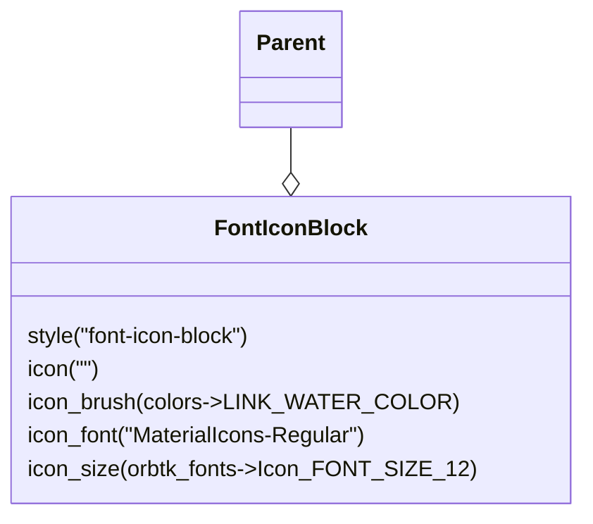

# Template: FontIconBlock

This subsection will describe an `OrbTk` UI element called **FontIconBlock**.

The complete source that demonstrates this template element is presented in [Listing 7-1][widget_button].
After a successful compile run, it should produce a window analog to the attached screen-shot:

[](img/examples/orbtk_widget_font_icon_block.png)

We did compile for a desktop target (Linux). And if you did clone the
book source to your development system, the corresponding source-code
examples can be found inside the listings sub-directory. To compile it
yourself, first change into this directory

*src/listings/ch03-07-widget-font-icon-block/listing-07-01*

Next, use **cargo** to pipeline the compile and linking process. In
the end the target binary will be executed. If you like to get a
rendered output, that annotates the tree structure with respect to
their bounds, please make use of the feature **debug**. This feature
will draw blue boxes around any involved entities.

```console
$ cargo run --features debug --bin orbtk_widget_font_icon_block
```

[](img/examples/orbtk_widget_font_icon_block_debug.png)

[widget_button]: #complete-example-source

## Recap and annotation

### The anatomy of this template

Let’s review the relevant parts of the **orbtk_widget_font_icon_block** application.

### OrbTk code framing the app
As a first step, We put the needed OrbTk parts into scope.

```rust,ignore
{{#include ./listings/ch03-07-widget-font-icon-block/listing-07-01/src/main.rs:Use}}
```

Next we do declare `"str"` constants to any involved id's. This isn't
strictly necessary, but helps to identify the entities by meaningful names.

```rust,ignore
{{#include ./listings/ch03-07-widget-font-icon-block/listing-07-01/src/main.rs:Constants}}
```

The **main** function instantiates a new application, that makes use of
the **theme_default_dark** and a re-sizable **Window** as its first
children. For a deeper insight into this UI elements, please consult the
relevant part in this book.

We will now focus our interest on the next part, where we do create a
**FontIconBlockView** as a child inside the **Window** entity.


```rust,ignore
{{#include ./listings/ch03-07-widget-font-icon-block/listing-07-01/src/main.rs:Child_FontIconBlockView}}
```

The syntax advises the compiler, to implement a *FontIconBlockView* for the
**Template** trait. The `widget!()` macro relieves us to type out all
the boiler plate stuff and takes care to create the needed code sugar.

```rust,ignore
{{#include ./listings/ch03-07-widget-font-icon-block/listing-07-01/src/main.rs:MacroCall_View}}
```

We do use a [**Container**][widget_container] widget as a first child
inside the template method. It allows us, to place a padding around
the included children. Please refer to its documentation section for
a deeper dive.

```rust,ignore
{{#include ./listings/ch03-07-widget-font-icon-block/listing-07-01/src/main.rs:Child_Container_Definition}}
```

The container will have a [**Stack**][widget_stack] child, that we do
consume to attach multiple children in a vertical
direction. A [**TextBlock**][widget_textblock] is used to render a
header text above the **FontIconBlock** child. This is the part of the
code, that we are finally interested in.

[widget_container]: https://doc.redox-os.org/orbtk-book/ch03-05-widget-container.html
[widget_stack]: https://doc.redox-os.org/orbtk-book/ch03-21-widget-stack.html
[widget_textblock]: https://doc.redox-os.org/orbtk-book/ch03-24-widget-textblock.html

### OrbTk widget specific: **FontIconBlock**

We are going to consume a **font_icon_block** widget.

As any other template inside the widget tree of `OrbTk`, the template
is rendered with a preset of sane property values. If you choose not to
explicitly declare any property values inside the view code, the
defaults coded in the template definition will be evaluated.

The following Class-Diagram presents the **font_icon_block** internal widget tree,
including its default property values:



<span class="caption">Workflow 7-1: FontIconBlock tree</span>

If you uncomment the ".style()" property, all explicitly defined
properties inside the view are rendered useless. The properties
assingned via a theme definition take precedence over property
definitons inside the view code.

```rust,ignore
{{#include ./listings/ch03-07-widget-font-icon-block/listing-07-01/src/main.rs:Child_FontIconBlock}}
```

### Complete example source

Find attached the complete source code for our **orbtk_widget_button**
example.

```rust,ignore
{{#include ./listings/ch03-07-widget-font-icon-block/listing-07-01/src/main.rs:All}}
```

<span class="caption">Listing 7-2: orbtk_widget_button - Available button styles.</span>

### Compiling and Running Are Separate Steps

The **cargo** compiled `orbtk_widget_font_icon_block` binary will be placed in the target subfolder of the project.

```console
$ cargo build --release --bin orbtk_widget_font_icon_block
$ ../target/release/orbtk_widget_font_icon_block
```

On Windows, you need to use `backslash` as a path delimiter:

```powershell
> cargo build --release --bin orbtk_widget_font_icon_block
> ..\target\release\orbtk_widget_font_icon_block.exe
```
