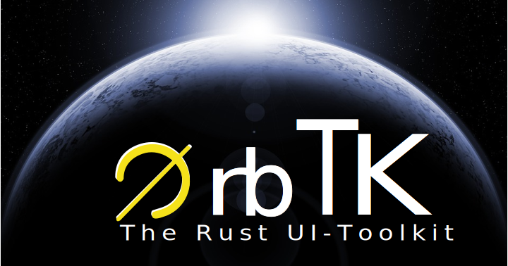

# The Orbital Widget Toolkit

[](img/orbtk_planet.svg)

*by Florian Blasius, with contributions from the Rust Community*

This version of the text assumes you’re using OrbTK v0.3.1 or later in
conjuction with Rust 1.41.0 or later.  *Cargo.toml* should define
`edition="2018"`. That enables and uses Rust 2018 Edition idioms in
all derived projects.

See the [“Installation” section of Chapter 1][install]
to install or update OrbTK.

The 2020 Edition of this book is the initial release. It will be
released with the OrbTK version 0.3.1.

- Appendix A, “Keywords,” explains the new raw identifiers.
- Appendix D is work in progress and will release instances of this book
  once they are translated to other languages.

For online reading, a HTML rendered version is available at
[Orbtk book_en][orbtk_book_en]. Alternatively you might want to have it
handy for offline usage. Go ahead and download its source, kick on mdbook
and define the taret location.

```console
mdbook build --dest-dir doc/book_en --open
```

<!---
This text is available in [paperback and ebook format from No Starch Press][nsprust].
-->

[install]: ch01-01-installation.html
[nsprust]: https://nostarch.com/orbtk
[orbtk_book_en]: https://github.com/redox-os/orbtk-book

<!-- [orbtk_book_en_stable]: https://doc.orbtk.org/stable/book_en/html/print.html -->
